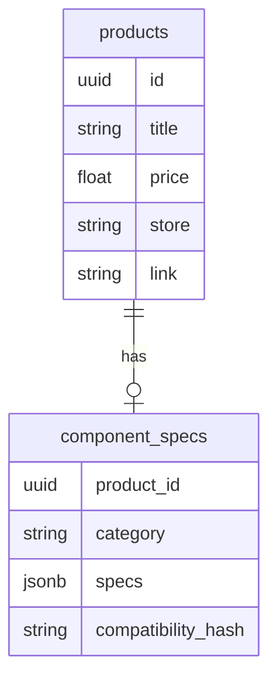

# План получения компонентов и внедрения ИИ-подбора

## 1. Источники данных (без парсинга DNS)
Для получения актуального списка комплектующих мы будем использовать комбинированный подход:
- **Perplexity API / OpenAI с поиском:** Вместо написания парсера для каждого сайта, мы будем использовать LLM для генерации структурированных списков (JSON) актуальных товаров.
- **Open Source Базы:** Загрузка "скелета" базы (названия, основные ТТХ) из открытых репозиториев (например, PCPartPicker datasets на GitHub или Kaggle).

## 2. Архитектура ИИ-подбора
Мы внедрим "AI Assistant", который будет работать на базе **OpenAI GPT-4o** или **Claude 3.5 Sonnet**.
- **User Prompt:** "Собери комп для монтажа 4k видео за 150к рублей".
- **AI Logic:**
  1. Нейронка анализирует запрос.
  2. Формирует список необходимых характеристик (например, CPU > 12 ядер, RAM > 32GB).
  3. Делает запрос к нашей БД (Supabase) для поиска реальных товаров из магазинов, подходящих под критерии.
  4. Проверяет совместимость (Socket, TDP, Form-factor).
  5. Выдает результат со ссылками.

## 3. Расширение БД
Текущая таблица `products` хранит только общую информацию. Нам нужно добавить таблицу `component_specs` для хранения технических деталей, необходимых для проверки совместимости.

## 4. Следующие шаги
1. **Выбор API:** Я рекомендую начать с **OpenAI**, так как у них лучшая поддержка structured outputs (JSON mode), что критично для подбора.
2. **Скрипт импорта:** Создадим Node.js скрипт, который заполнит базу "эталонными" данными по категориям (Процессоры, Видеокарты, Материнки).
3. **Обновление Schema:** Применим новую структуру в Supabase.
